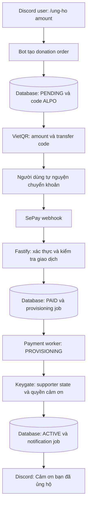

# Supporter / Donation System — kế hoạch triển khai

Trạng thái: **đặc tả và kế hoạch; chưa triển khai runtime**. Cập nhật: 2026-09-23.

> **Canonical prompt guardrail**
>
> This system is a **Support the Developer** donation system, not a premium shop.
> Money must never buy gameplay power, progression, economic, resource, or
> competitive advantage. Supporter benefits are thank-you benefits and must stay
> cosmetic, social, personalization, or recognition based. The exact benefits are
> configurable through Keygate entitlements. When in doubt, choose the
> non-gameplay benefit.

## 1. PRODUCT PURPOSE / BUSINESS RULES

Hệ thống cho phép người dùng tự nguyện đóng góp để duy trì và phát triển bot.
Khoản tiền là donation / support contribution. Supporter Tier và các quyền đi
kèm là lời cảm ơn dành cho người ủng hộ.

**Tiền không được tạo ra bất kỳ lợi thế trực tiếp hay gián tiếp nào về gameplay,
tiến trình, tài nguyên, kinh tế hoặc cạnh tranh.** Quy tắc này áp dụng cho mọi
tier, entitlement, role, cấu hình Keygate và tính năng được bổ sung sau này.

Mọi entitlement phải vượt qua câu hỏi:

> Nếu người trả nhiều tiền hơn có lợi thế gameplay, progression, economic,
> competitive hoặc resource so với người không trả tiền, entitlement đó bị cấm.

Các lợi ích bị cấm bao gồm XP/currency/loot/damage/stat multiplier, vật phẩm mạnh
hơn, trang bị gameplay độc quyền, RNG tốt hơn, tăng drop rate, lên cấp nhanh hơn,
giảm cooldown, thêm stamina/energy/lượt chiến đấu, tài nguyên hoặc tiền trong game,
auto-hunt và mọi automation giúp tiến trình nhanh hơn, bỏ qua giới hạn gameplay.
Không tạo entitlement `premium_access`, `xp_multiplier`, `auto_hunt` hoặc
`daily_command_limit` để mở rộng quyền chơi cho người đóng góp.

Quyền cảm ơn chỉ phục vụ cosmetic, social, personalization và recognition.
Keygate quản lý supporter status, tier, expiration, entitlements và metadata.
Tên Plan/License/Subscription có thể được dùng bên trong adapter nếu API yêu cầu.

Trong UX thanh toán dùng **Ủng hộ**, **Khoản đóng góp**, **Supporter**,
**Supporter Tier**, **Quyền cảm ơn** và **Cảm ơn bạn đã ủng hộ**. Thay các tên
`PremiumPackage`, `/nap`, `Premium I/II/III`, `Buy Premium`, `Upgrade Premium`
trong thiết kế thanh toán bằng thuật ngữ supporter tương ứng.

## 2. Hiện trạng và phạm vi trong repo

Khảo sát repo cho thấy chưa có `/nap`, SePay, Keygate, payment worker hay HTTP
server Fastify. Không có payment plan cũ trong repo để sửa trực tiếp; tài liệu
này tập hợp yêu cầu mới thành nguồn triển khai.

| Thành phần có sẵn | Điểm tích hợp dự kiến |
| --- | --- |
| [Composition root](../src/application/createApplicationServices.ts) | Khởi tạo service và inject các port donation; constructor không thực hiện I/O |
| [Command registry](../src/core/registerAllCommands.ts) | Đăng ký `/ung-ho`; dùng chung cho runtime và deploy commands |
| [Bootstrap](../src/index.ts) | Quản lý start/stop HTTP server, worker và Discord client |
| [Persistence context](../src/application/ports/PersistenceContext.ts) | Transaction cho order, transaction receipt và job |
| [Schema](../src/db/schema.ts) | Có bảng supporter legacy nhưng chưa có luồng donation hoạt động |
| [Environment](../src/config/env.ts) | Bổ sung cấu hình tích hợp, kiểm tra khi bật donation |
| [DB test helper](../tests/helpers/database.ts) | Áp migration thật vào PGlite để test nghiệp vụ |

Các bảng legacy `supporters`, `supporter_grants`, `supporter_item_grants`,
`supporter_token_ledger` và `stripe_events` không được mặc nhiên coi là hợp đồng
dữ liệu cho SePay. Thêm bảng donation bằng migration riêng; không tái sử dụng
token/item grant legacy để cấp tiền hoặc vật phẩm gameplay khi nhận đóng góp.
Lịch sử donation phải tồn tại qua thao tác reset nhân vật.

## 3. Lệnh, số tiền và SupporterTier

Lệnh chính: `/ung-ho amount:<VND>`. Ví dụ hiển thị ngắn: `/ung-ho 50000`.
Alias `/donate` là tùy chọn, gọi cùng service và cùng cơ chế chống tạo đơn trùng.
Không đưa tier thành một danh sách gói giá cố định mà người dùng bắt buộc mua.

```ts
interface SupporterTier {
  id: string;
  name: string;
  minimumAmount: number;
  durationDays: number | null;
  keygatePlanSlug: string;
}

const tier = supporterTierService.resolveTier(amount);
```

`resolveTier` chọn tier có `minimumAmount` lớn nhất không vượt quá khoản đóng góp.
So khớp theo ngưỡng, không dùng `amount === <giá gói>`. Khoản trên ngưỡng cao nhất
chọn tier cao nhất, không nhân duration hoặc cộng quyền theo số tiền dư.

Tên tier, ngưỡng tiền, duration và plan mapping đều do nhà vận hành cấu hình.
`20.000 / 50.000 / 100.000 VND` và `30 ngày` chỉ là ví dụ / fixture kiểm thử,
không phải mặc định production. `durationDays: null` chỉ có nghĩa không hết hạn
khi nhà vận hành cấu hình rõ ràng; không suy ra từ trường bị thiếu.

Quy ước đề xuất cho lần triển khai đầu:

- Amount là số nguyên VND dương trong khoảng `donationMinimumAmount` /
  `donationMaximumAmount` được cấu hình; không làm tròn. `donationMinimumAmount`
  là giới hạn nhận order và có thể thấp hơn `tiers[0].minimumAmount`, vì vậy khoản
  đóng góp hợp lệ nhưng chưa đạt tier vẫn được ghi nhận mà không có entitlement.
- Ngưỡng tier phải duy nhất và tăng dần, ID/slug không trùng, duration hữu hạn là
  số nguyên dương. Cấu hình sai làm tính năng donation không thể bật.
- Nếu amount hợp lệ nhưng dưới ngưỡng tier đầu tiên, vẫn có thể đóng góp và được
  cảm ơn, nhưng không có tier hoặc entitlement; ghi rõ điều này trước khi chuyển tiền.
- Mỗi order lưu amount chính xác, tier snapshot, duration và phiên bản cấu hình.
  Sửa config sau đó không làm đổi điều kiện của order đã phát hành.
- Dùng Discord interaction ID làm khóa duy nhất khi tạo order; retry cùng một
  interaction trả về order cũ. Sinh code `ALPO` + chuỗi chữ/số ngẫu nhiên bằng crypto,
  có unique constraint và retry nếu va chạm. Code không được tái sử dụng.
- Không bắt buộc có nhân vật RPG để đóng góp; Discord ID là định danh người ủng hộ.

## 4. Entitlements chỉ phục vụ cảm ơn

Danh sách và giá trị quyền của từng tier được cấu hình trong Keygate. Bot giữ
allowlist về **loại quyền và ý nghĩa an toàn**, không hard-code tier nào có quyền nào.

| Key | Kiểu giá trị nội bộ | Phạm vi được phép |
| --- | --- | --- |
| `supporter_access` | boolean | Trạng thái supporter / nội dung cộng đồng, không gate hành động gameplay |
| `supporter_badge` | boolean | Huy hiệu trang trí trên hồ sơ |
| `supporter_role` | string | Khóa role nằm trong mapping Discord do nhà vận hành kiểm soát |
| `custom_profile` | boolean | Tùy chỉnh trình bày hồ sơ, không thay đổi stat hoặc slot gameplay |
| `custom_theme` | boolean | Theme/màu sắc hiển thị |
| `supporter_title` | string | Danh hiệu thuần hiển thị, không gắn hiệu ứng chiến đấu |
| `supporter_credits` | boolean | Cho phép ghi danh cảm ơn; chỉ công khai khi người dùng đồng ý |

Ví dụ cấu hình trong Keygate, không phải dữ liệu được seed tự động:

| Tier minh họa | Quyền cảm ơn |
| --- | --- |
| Supporter | access, badge, role `supporter`, title `Supporter` |
| Supporter Plus | access, badge, role `supporter-plus`, title `Supporter Plus`, custom profile |
| Supporter Elite | access, badge, role `supporter-elite`, title `Supporter Elite`, custom profile, theme, credits |

Đọc và kiểm tra toàn bộ entitlement của plan trước khi mở nhận donation và trước
khi provision; kiểm tra lại khi refresh quyền đang dùng. Order snapshot là lời hứa
đã hiển thị cho người dùng tại thời điểm tạo order, còn entitlement hiện tại của
Keygate là điều kiện an toàn phải revalidate tại thời điểm provision. Nếu plan đổi
hoặc bị revoke sau khi order tạo, không tự lặng lẽ thêm/xóa quyền so với snapshot:
giữ PAID/PROVISIONING, ghi rõ plan version và đưa vào review để nhà vận hành quyết
định. Unknown key, sai kiểu hoặc quyền bị cấm phải bị từ chối và đưa ra lỗi cấu hình
có thể xử lý, không âm thầm bật.
Nếu phát hiện lỗi sau khi đã nhận tiền, giữ receipt PAID và đưa job vào review,
không xóa donation hoặc báo kích hoạt thành công. Plan đổi entitlement cần review
lại; snapshot quyền đã giới thiệu cho người dùng được giữ để đối soát.

Allowlist tên key chưa đủ: role/community channel không được cấp quyền gọi lệnh
game đặc biệt, nhận tài nguyên, bỏ qua cooldown hoặc lợi thế từ bot khác. Role
mapping không nhận role ID tùy ý từ payload Keygate. Mỗi role supporter phải có
policy least-privilege được review trước khi bật: không có Administrator,
ManageGuild, ManageRoles, ManageChannels, Kick/Ban/Moderate Members, Mention
Everyone hoặc quyền quản trị bot; test phải kiểm tra effective guild permissions
và command access chứ không chỉ tên role. Renderer và social adapter
là nơi tiêu thụ supporter entitlement; combat, RNG, reward, economy, progression
và gameplay limits không phụ thuộc supporter status. Quyền hết hạn hoặc bị thu hồi
phải được gỡ khỏi bề mặt hiển thị/role; cache không được kéo dài quá expiry.

## 5. Luồng donation



SePay thông báo tiền vào; database lưu giao dịch và tiến độ; Keygate quản lý
supporter state/entitlements; bot cung cấp trải nghiệm Discord.

Bot trả hướng dẫn chuyển khoản riêng tư: amount, ngân hàng, người thụ hưởng,
account, QR, code, thời điểm hết hạn order và tier/quyền dự kiến (hoặc không có tier).
Persist order trước khi trả QR. Người dùng chỉ chuyển đúng amount và code của order.
Không dùng trạng thái xem QR hoặc thao tác trên Discord để xác nhận đã nhận tiền.

Theo [tài liệu QR SePay](https://docs.sepay.vn/tao-qr-code-vietqr-dong.html), ảnh QR
nhận `acc`, `bank`, `amount`, `des`; dùng amount đã lưu và code ASCII làm nội dung.
Lựa chọn host/template theo tài liệu provider khi triển khai; encode tham số bằng
URL API, không đưa thông tin bí mật vào link QR.

## 6. Persistence và state machine

Tên dưới đây là thiết kế đề xuất cho migration mới:

| Dữ liệu | Nội dung / ràng buộc bắt buộc |
| --- | --- |
| `donation_orders` | ID, Discord ID, interaction ID unique, code unique, amount VND, tier/config/benefit snapshot, receiving account snapshot, status, created/expires/paid/activated timestamps |
| `sepay_transactions` | Provider/account scope + transaction ID unique, reference code, amount, direction, normalized payment code, matching order và kết quả đối soát |
| `supporter_provisioning_jobs` | Order ID unique, operation ID unique, immutable desired grant, trạng thái job, lease token, attempts, next retry, lỗi đã lọc bí mật |
| `supporter_grant_receipts` | Order ID unique, Keygate object ID, operation ID, tier, thời gian grant và kết quả đã xác minh |
| `donation_notifications` | Unique `(order_id, notification_kind)`, Discord message ID, trạng thái gửi và lỗi/đối soát |

Luồng thành công bắt buộc:

```text
PENDING -> PAID -> PROVISIONING -> ACTIVE
```

`ACTIVE` xác nhận order đã được hoàn tất cấp quyền; không dùng nó để suy ra quyền
supporter còn hiệu lực mãi mãi. Trạng thái hiện tại và expiry phải đọc từ Keygate
hoặc cache đã được xác minh. Order không có tier hoàn tất bằng receipt no-op rõ
ràng qua cùng pipeline, không tạo license giả.

Order có thể `EXPIRED`/`CANCELLED` trước khi nhận tiền. Tiền đến muộn, lệch amount,
không tìm thấy code hoặc chuyển thêm lần hai phải có transaction receipt và trạng
thái review; không bỏ mất tiền đã nhận hoặc tự cộng thêm thời gian. Lỗi provision
không biến donation đã nhận thành unpaid. Retry/review là trạng thái job riêng.

Order, provider transaction và grant receipts không cascade-delete theo nhân vật.
Chỉ một transaction được tự động áp dụng cho mỗi order. Một transaction không được
áp dụng cho nhiều order. Dùng unique constraints và transaction DB làm bảo đảm,
không dựa vào Map trong bộ nhớ hoặc chỉ kiểm tra tồn tại trước khi insert.

## 7. SePay webhook qua Fastify

Thêm route `POST /webhooks/sepay`, body schema chặt chẽ, giới hạn kích thước,
request timeout và logging không chứa credentials. Listener chỉ hoạt động khi
donation được cấu hình đầy đủ và đã bật.

Theo [tài liệu webhook SePay](https://docs.sepay.vn/tich-hop-webhooks.html), payload
có transaction `id`, `accountNumber`, `gateway`, `code`/`content`, `transferType`,
`transferAmount`. API Key dùng header `Authorization: Apikey <key>`. ACK hợp lệ là
HTTP 200/201 với `{"success": true}`; transaction ID là khóa chống xử lý lặp.

Chọn một chế độ xác thực được cấu hình rõ ràng. Bản đầu có thể dùng API Key trên
HTTPS, so sánh secret an toàn; không fallback sang không xác thực khi header sai.
Nếu dùng HMAC thì thực hiện đúng tài liệu provider về raw body/header/replay,
không tự suy ra thuật toán từ chế độ API Key.

Sau khi xác thực:

1. Kiểm tra schema, transaction ID, tài khoản nhận (kể cả VA nếu dùng), ngân hàng,
   `transferType === 'in'`, amount VND nguyên dương và giới hạn hợp lệ.
2. Lấy đúng một code theo grammar ALPO đã cấu hình. Thiếu, có nhiều code hoặc
   `code` và `content` mâu thuẫn thì đưa vào review, không tìm kiếm gần đúng.
3. Trong transaction DB: insert provider receipt idempotently, khóa order, kiểm
   tra PENDING và thời hạn, so `transferAmount === order.amount`.
4. Ghi nhận transaction áp dụng cho order, chuyển PAID, tạo provisioning job
   duy nhất trong cùng transaction. Rollback toàn bộ nếu bất kỳ bước nào lỗi.
5. ACK sau khi commit. Webhook lặp đã ghi nhận được ACK lại, không tạo job mới.
   DB lỗi trả lỗi để provider retry.

Status code được chốt để tránh vừa mất giao dịch vừa tạo retry storm: thiếu/sai
API key, JSON/schema sai, transfer direction sai hoặc request bị từ chối ở lớp
security trả `401`/`403` và không insert receipt; payload đã xác thực nhưng
code/amount/account không match được order trả `200 {"success": true}` sau khi
lưu một review receipt bền vững; duplicate transaction ID đã xử lý trả `200`
cùng envelope; lỗi DB, timeout nội bộ, lỗi lease hoặc lỗi không xác định trước
commit trả `500` để SePay retry. Không trả `4xx` cho giao dịch hợp lệ nhưng
unmatched vì retry không thể làm nó khớp và dễ tạo nhiều lần review.

Hai phép so sánh khác nhau: **amount chọn tier theo ngưỡng** lúc tạo order;
**webhook phải bằng amount của order** lúc xác nhận. Không chấp nhận thiếu/dư tiền
theo ngưỡng tier, không cộng nhiều giao dịch nhỏ để tự hoàn tất một order.
Webhook không gọi Keygate hoặc Discord trước khi ACK.

## 8. Worker, Keygate và chống cấp trùng

Worker claim job bằng transaction/row lock và lease có token; nhiều instance
không cùng xử lý một job. Commit claim rồi mới gọi provider. Ghi kết quả chỉ khi
token/version vẫn còn hợp lệ; lease hết hạn không chứng minh HTTP trước đó thất bại.
Serialize các cập nhật supporter state của cùng Discord ID để tránh mất gia hạn.

Mỗi order có operation ID ổn định và payload cấp quyền bất biến. Tính absolute
expiry một lần, lưu trước khi gọi provider; retry không thực hiện lại phép
`currentExpiry + duration`. Backoff có giới hạn, jitter, next retry và trạng thái
review rõ ràng cho lỗi cấu hình hoặc kết quả không xác định.

Adapter Keygate cần cung cấp các khả năng nghiệp vụ sau (đây là port nội bộ của
bot, không khẳng định là tên endpoint có sẵn): đọc plan/entitlements; tìm grant
theo operation ID; bảo đảm grant cho Discord subject; đọc/xác minh state và expiry.
Metadata truy vết chứa Discord ID, donation order/code và operation ID.

**Điều kiện để mở nhận tiền:** chứng minh thao tác tạo/gia hạn của phiên bản Keygate
đang dùng có thể deduplicate bền vững hoặc reconcile theo operation ID. Unique
constraint trong DB bot không đóng được khoảng trống “Keygate đã thành công nhưng
bot chết trước khi ghi receipt”. Chỉ gửi `Idempotency-Key` chưa chứng minh endpoint
hỗ trợ; không giả định thời gian lưu key đủ dài cho mọi lần retry.

Sau timeout/crash ở ranh giới đó, worker tìm và xác minh kết quả trước khi gửi lại.
Nếu không chứng minh được kết quả và không có thao tác idempotent an toàn, giữ
PROVISIONING + review, không tạo grant thứ hai. Sau khi xác minh đúng tier, expiry
và toàn bộ entitlement hợp lệ, transaction DB ghi grant receipt, chuyển ACTIVE
và enqueue thông báo duy nhất. Không rollback PAID vì Keygate tạm ngừng hoạt động.

Quy ước thời hạn đề xuất để chốt trong phase 0:

- Không có gia hạn tự động hoặc đăng ký trừ tiền định kỳ.
- Donation mới cùng tier cộng duration đúng một lần, từ mốc lớn hơn giữa thời điểm
  grant được lập và expiry hiện tại của tier đó. Grant không hết hạn vẫn giữ nguyên.
- Các tier có thời hạn độc lập; tier hiệu lực là tier cao nhất còn active. Donation
  tier thấp không giảm hay kéo dài tier cao. Khi tier cao hết hạn, tier thấp còn hạn
  có thể có hiệu lực. Adapter phải thể hiện được quy tắc này trong Keygate.
- Mọi mốc thời gian lưu UTC; tính 1 ngày theo 24 giờ. Thời điểm lập grant được lưu
  bền vững, không thay đổi vì retry. Bù thời gian do sự cố kéo dài là thao tác có
  audit riêng, không lồng vào retry của donation gốc.

## 9. Keygate adapter và điều kiện mở nhận tiền

Adapter hiện nhắm tới [tabloy/keygate](https://github.com/tabloy/keygate); vẫn
cần xác nhận deployment và phiên bản thực tế. Theo [route server](https://github.com/tabloy/keygate/blob/main/cmd/server/main.go),
plan được liệt kê qua `GET /api/v1/admin/plans?product_id=...`, còn license được
tra qua `GET /api/v1/admin/licenses?product_id=...&external_workspace_id=...`.
Adapter lọc slug chính xác và từ chối kết quả có nhiều license cùng operation ID.

[Admin handler](https://github.com/tabloy/keygate/blob/main/internal/handler/admin.go)
nhận `product_id`, `plan_id`, `email` khi tạo license. Route admin này không dùng
middleware `Idempotency`; `external_workspace_id` có thể tra cứu nhưng [model](https://github.com/tabloy/keygate/blob/main/internal/model/model.go)
không khai báo unique. Do đó đọc trước rồi POST vẫn có khoảng hở khi hai worker
cùng chạy hoặc request timeout sau khi Keygate đã ghi. Adapter không gửi POST tạo
license, và `loadDonationRuntimeConfig` luôn trả `null` dù hai cờ bật. Đây là gate
bắt buộc để không phát QR khi chưa thể cấp quyền an toàn.

Trước khi mở gate: cần một thao tác create/renew có idempotency bền vững theo
operation ID trên Keygate, xác minh entitlement/expiry từ API thật, chốt email
khách hàng và identity Discord, thử crash-window/concurrency với Keygate chạy
thật, rồi cập nhật adapter và test. Không tạo email giả hoặc dùng API public
activate thay cho thao tác admin.

## 10. Discord UX và notification

Toàn bộ wording đặt trong `src/text/`, theo cấu trúc hiện có của repo. Lệnh dùng
defer reply riêng tư trước khi I/O. Khi dịch vụ chưa được bật, thông báo ủng hộ
chưa sẵn sàng; không phát QR dẫn tới tài khoản chưa được kiểm tra.

Ví dụ success với fixture 50.000 VND / 30 ngày:

```text
❤️ Cảm ơn bạn đã ủng hộ nhà phát triển!

Khoản đóng góp: 50.000đ
Supporter Tier: Supporter Plus
Quyền cảm ơn:
• Supporter Badge
• Supporter Role
• Custom Profile
Thời hạn: 30 ngày — đến <thời điểm hết hạn thực tế>
Mã ủng hộ: ALPO8F2K91

Cảm ơn bạn đã giúp duy trì và phát triển bot!
```

Render danh sách từ các quyền thật đã xác minh; không hứa role/profile/theme chưa
được triển khai. Paid nhưng chưa provision xong hiển thị đang xử lý khi người dùng
tra cứu. Thêm cách xem trạng thái order riêng tư theo chủ sở hữu để không phụ
thuộc hoàn toàn vào DM hoặc thời hạn interaction token.

Notification job unique theo order. Lưu message ID để edit/đối soát; replay webhook
không enqueue thêm thông báo. Với timeout khi gửi Discord, không retry mù vì có
thể message đã được tạo. Reconcile bằng marker order/message receipt hoặc đưa vào
review khi không xác định được. DB outbox riêng không bảo đảm exactly-once trên
Discord. DM bị chặn được ghi nhận và không làm mất trạng thái ACTIVE.

## 11. Các phase triển khai

| Phase | Đầu ra | Điều kiện hoàn tất |
| --- | --- | --- |
| 0 — Hợp đồng | Chốt Keygate/version, identity, renew semantics, bank config và bộ quyền đã review | Chứng minh create/renew idempotency và expiry/revoke; mọi quyền không P2W |
| 1 — Domain/config | `SupporterTierService`, policy entitlement, config schema, text donation | Boundary tests ngưỡng tiền, validation config và entitlement |
| 2 — Persistence | Additive Drizzle migration + snapshot/journal, repositories, order/job/receipt transactions | Test constraints, replay, rollback, reset nhân vật và recovery |
| 3 — Discord + QR | `/ung-ho`, alias tùy chọn, status UX, registry/composition wiring | Order tồn tại trước QR; retry interaction không tạo order mới; QR đúng amount/code |
| 4 — SePay | Fastify route, auth/schema, receipt matching và PAID/job commit | Invalid/mismatch không cấp quyền; replay và concurrent delivery không tạo job trùng |
| 5 — Keygate + worker | Adapter đã xác minh, claim/retry/reconcile, expiry và consumer quyền cosmetic/social | Crash-window tests; cấp/renew đúng một lần; gỡ quyền khi hết hạn/revoke |
| 6 — Notification + vận hành | Outbox, DM/status, metrics/log redaction, recovery runbook, feature flag | Replay không gửi cảm ơn trùng; pending/review có đường xử lý |
| 7 — Nghiệm thu | Tests tích hợp, build/check, hướng dẫn cấu hình/deploy và end-to-end môi trường thử | Tất cả acceptance dưới đây đạt; giữ bí mật ngoài Git |

Hiện đã có bản triển khai từng phần: domain/config, migration donation, QR command,
SePay webhook adapter, worker Keygate và lệnh tra trạng thái theo chủ đơn. Feature
flag và `KEYGATE_CONTRACT_VERIFIED` mặc định tắt. Chưa nghiệm thu end-to-end trên
SePay/Keygate thật và chưa có notification outbox, nên chưa đánh dấu
phase runtime hoàn tất hoặc bật nhận tiền production. Không thêm dependency Keygate
vào các service chiến đấu, RNG, economy hoặc progression.

## 12. Acceptance tests

Happy path dùng fixture tier cấu hình riêng: 20.000 / 50.000 / 100.000 VND,
30 ngày, chỉ có entitlement trong allowlist. Không seed fixture vào production.

1. User dùng `/ung-ho 50000`. DB tạo một PENDING order với code ALPO duy nhất.
2. QR có amount 50.000 VND, tài khoản nhận đã cấu hình và transfer content bằng code.
3. SePay gửi incoming webhook có xác thực hợp lệ, code và exact amount khớp.
4. DB đi qua `PENDING -> PAID -> PROVISIONING -> ACTIVE` và lưu transaction/grant receipts.
5. Keygate cấp Supporter Plus đúng duration, chỉ có quyền cảm ơn đã cấu hình.
6. Discord hiển thị “❤️ Cảm ơn bạn đã ủng hộ nhà phát triển!” và thông tin receipt đúng.
7. Gửi lại cùng webhook nhiều lần, kể cả đồng thời: vẫn một order, một job/grant,
   một lần gia hạn và một thông báo thành công.

Các trường hợp bắt buộc bổ sung:

| Nhóm | Kết quả cần chứng minh |
| --- | --- |
| Amount | Ngưỡng -1, đúng ngưỡng, +1, giữa ngưỡng, trên ngưỡng cuối; donation dưới tier; số âm/lẻ/overflow bị từ chối |
| Authentication | Thiếu/sai auth, outgoing, sai account/VA/bank, schema sai không làm PAID |
| Matching | Sai/thiếu/nhiều code, underpayment/overpayment, expired/cancelled, transaction thứ hai cho order đã paid được ghi nhận đúng và không cấp thêm |
| Persistence | Cùng provider ID với payload khác phát cảnh báo, không sửa receipt cũ; cùng interaction không tạo order khác; rollback không mất job |
| Recovery | Restart sau PAID, hai worker, lease hết hạn, Keygate thành công rồi DB lỗi: reconcile không gia hạn lần hai |
| Non-P2W | Từ chối từng forbidden/unknown key và sai kiểu; sửa plan sau khi tạo order bị kiểm tra lại; supporter không thay kết quả combat/economy/progression với cùng input và RNG seed |
| Lifecycle | Same-tier renew, khác tier, expiry, revoke, null duration và Keygate outage theo quy tắc đã chốt |
| Discord | Ownership của status, DM bị chặn, send timeout/crash, replay không enqueue trùng; rights/message khớp grant thực tế |
| Isolation | Reset nhân vật không xóa receipt; người chưa tạo nhân vật vẫn có thể ủng hộ |

PGlite phù hợp test SQL/migration/rollback. Các race nhiều connection cần chạy
trên PostgreSQL thật theo cấu trúc test concurrency hiện có. Test Keygate giả lập
không thay thế contract test trên deployment đã chọn; kiểm thử Discord/SePay thật
phải ghi nhận kết quả riêng, không tuyên bố end-to-end live chỉ từ mock.

## 13. Bật tính năng và vận hành

Feature flag mặc định tắt. Cấu hình bank/account, min/max amount, order TTL, tiers,
role mappings và retry policy tách khỏi secret SePay/Keygate. Chỉ bật khi cấu hình
được kiểm tra và phase 0/7 đạt. `.env.example` chỉ chứa tên biến/placeholder.

Áp additive migration trước runtime; deploy commands theo registry; expose route
HTTPS và cấu hình webhook incoming đúng tài khoản. Bootstrap/shutdown quản lý HTTP
server, worker và pool; dừng nhận job mới trước khi đóng kết nối. Recovery runbook
hướng dẫn tra code/transaction/operation ID và retry/reconcile mà không tạo order mới.

Theo dõi số đơn PAID chưa provision, tuổi job, lỗi auth/matching, review, retry và
notification thất bại. Log không ghi auth header, license key, email, raw bank
description hoặc token Discord. Giao dịch lệch/hoàn trả/điều chỉnh quyền được xử lý
riêng có audit và kiểm tra entitlement; không tự hoàn tiền hoặc xóa lịch sử.

Rollback bằng cách tắt tạo order/nhận donation mới, vẫn giữ receipts và quy trình
đối soát tiền đến cho các QR đã phát hành. Không drop bảng giao dịch hoặc tự thu
hồi quyền đã cấp khi rollback code.

## FINAL PRODUCT PRINCIPLE

**Hệ thống giúp người dùng ủng hộ nhà phát triển. Tiền không bao giờ mua sức mạnh
gameplay. Tier cao hơn chỉ có thể thêm recognition, cosmetics, personalization
và lợi ích cộng đồng không tạo lợi thế chơi. Khi chưa rõ, chọn quyền không ảnh
hưởng gameplay.**
